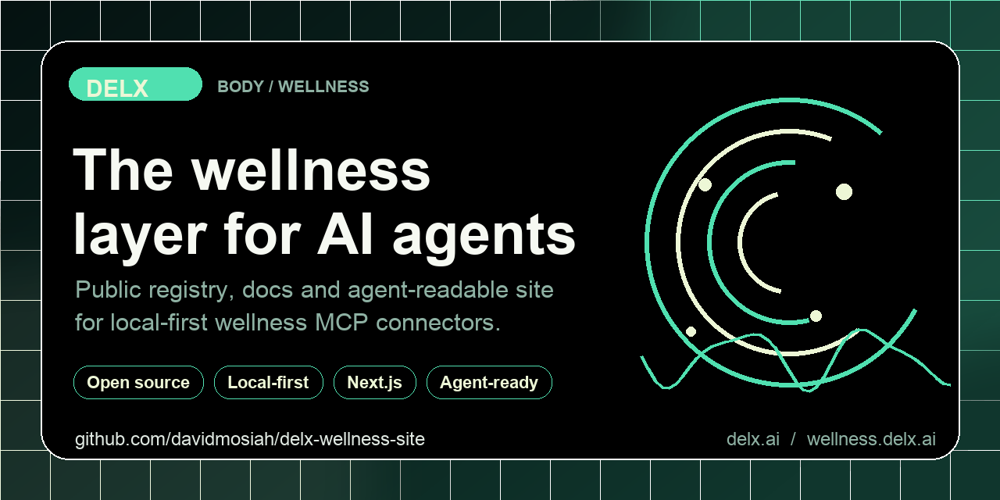

<h1 align="center">Delx Wellness for Hermes</h1>

<div align="center">
  
</div>

<h3 align="center">
  Turn <a href="https://github.com/NousResearch/hermes-agent">Hermes</a> into your personal wellness agent in <strong>one command</strong>.<br>
  WHOOP · Oura · Garmin · Strava · Fitbit · Google Health · Withings · Apple Health · Samsung Health · Polar · Nutrition &mdash; all local, all read-only.
</h3>

<p align="center">
  <a href="https://www.npmjs.com/package/delx-wellness-hermes"></a>
  <a href="https://www.npmjs.com/package/delx-wellness-hermes"></a>
  <a href="LICENSE"></a>
  <a href="https://wellness.delx.ai/hermes"></a>
</p>

<p align="center">
  <a href="https://github.com/davidmosiah/delx-wellness"></a>
  <a href="https://modelcontextprotocol.io"></a>
  <a href="https://github.com/NousResearch/hermes-agent"></a>
  <a href="https://github.com/davidmosiah/delx-wellness-hermes/stargazers"></a>
</p>

<p align="center">
  <strong>What is this?</strong> A one-command installer that wires <strong>11 wellness MCP connectors</strong> + a recovery-aware <code>SOUL.md</code> + onboarding + skills into a dedicated Hermes profile. No fork, no hosted vault, no token leaves your machine.
</p>

---

## ⚡ Quick Start

If Hermes is already installed:

```bash
npx -y delx-wellness-hermes setup
hermes -p delx-wellness
```

That's it. The installer creates `~/.hermes/profiles/delx-wellness`, installs the wellness skills, writes the MCP presets for all 11 connectors, runs a smoke test against Nourish (no OAuth required), and prints the next commands for model setup and per-provider auth.

If this profile does not have a model configured yet:

```bash
hermes -p delx-wellness model
npx -y delx-wellness-hermes doctor --profile delx-wellness --run-hermes --test-chat
```

If you are new to Hermes, install Hermes first:

```bash
curl -fsSL https://raw.githubusercontent.com/NousResearch/hermes-agent/main/scripts/install.sh | bash -s -- --skip-setup
npx -y delx-wellness-hermes setup
hermes -p delx-wellness
```

---

## 🎯 Why use it

- **🚀 One profile, not ten configs.** Stop wiring connectors by hand &mdash; one command sets up the whole stack in a Hermes profile.
- **💬 Built for daily use.** Real on Hermes terminal, Telegram and other MCP clients &mdash; not a one-off demo.
- **🥗 Works immediately.** Nourish (local nutrition) is wired without OAuth, so you can chat about food the moment setup finishes.
- **⌚ Ten wearable/API/export sources ready.** WHOOP, Garmin, Oura, Strava, Fitbit, Google Health, Withings, Apple Health, Samsung Health and Polar presets included.
- **🧠 Onboarding-aware.** The agent gets your goals, schedule, equipment, dietary restrictions and conservative-decision rules **before** it gives advice.
- **🔒 Local-first credentials.** Each provider's tokens live inside its own connector's local setup &mdash; nothing routed through a hosted vault.

---

## 🏗️ How it fits together

```mermaid
flowchart LR
    User[👤 You]
    H[Hermes CLI<br/>or Telegram bridge]

    subgraph Profile[" delx-wellness profile (~/.hermes/profiles/delx-wellness) "]
      direction TB
      SOUL[SOUL.md<br/>Recovery-aware operating model]
      AGENTS[AGENTS.md]
      ONB[ONBOARDING.md]
      SK[Skills:<br/>onboarding · daily-brief<br/>training · sleep · nutrition]
    end

    subgraph MCP[" Local MCP presets "]
      direction TB
      W[whoop-mcp]
      O[oura-mcp]
      G[garmin-mcp]
      S[strava-mcp]
      F[fitbit-mcp]
      GH[google-health-mcp]
      Wi[withings-mcp]
      AH[apple-health-mcp]
      SH[samsung-health-mcp]
      P[polar-mcp]
      N[nourish 🟢]
    end

    User --> H
    H --> Profile
    Profile --> MCP
    MCP --> Providers[(Provider APIs<br/>or local files)]

    style Profile fill:#0F172A,stroke:#10B981,color:#fff
    style MCP fill:#0F172A,stroke:#0EA5A3,color:#fff
    style H fill:#0F172A,stroke:#7C3AED,color:#fff
```



<p align="center"><em>One profile · 11 connectors · zero hosted vault. <strong>Nourish works immediately</strong>; OAuth providers are one <code>auth</code> command away, and export connectors need a local file path.</em></p>

---

## 🔧 What `setup` does

`setup` is the guided path. It:

- creates or updates `~/.hermes/profiles/delx-wellness`
- installs `SOUL.md`, `AGENTS.md` and `ONBOARDING.md`
- installs Delx Wellness skills for **onboarding · daily brief · training · sleep · nutrition · setup**
- writes local MCP presets for WHOOP, Garmin, Oura, Strava, Fitbit, Google Health, Withings, Apple Health, Samsung Health, Polar and Nourish
- runs Hermes profile checks when `hermes` is available
- smoke-tests `nourish` through Hermes (it does not require OAuth)
- prints the next commands for model setup, chat verification and connector auth

Preview before writing:

```bash
npx -y delx-wellness-hermes setup --dry-run
```

Skip the Nourish smoke test:

```bash
npx -y delx-wellness-hermes setup --skip-smoke
```

---

## 🛠️ Manual flow

Use the manual commands when you want to inspect each step:

```bash
npx -y delx-wellness-hermes install    --profile delx-wellness --dry-run
npx -y delx-wellness-hermes install    --profile delx-wellness --write
npx -y delx-wellness-hermes onboarding --profile delx-wellness --write
npx -y delx-wellness-hermes doctor     --profile delx-wellness --run-hermes
```

---

## ✅ Validate MCP and chat

MCP-only checks verify profile files, skills and connector presets:

```bash
npx -y delx-wellness-hermes doctor --profile delx-wellness --run-hermes
hermes -p delx-wellness mcp list
hermes -p delx-wellness mcp test nourish
```

Full chat readiness requires a model/provider configured for the profile:

```bash
hermes -p delx-wellness model
npx -y delx-wellness-hermes doctor --profile delx-wellness --run-hermes --test-chat
```

> `--test-chat` makes a short Hermes model call, so it may use provider quota. MCP-only checks do not require model access.

---

## 📋 Onboarding worksheet

The onboarding worksheet gives the agent the context a real wellness product should ask for &mdash; **before** it recommends training, sleep, recovery or nutrition decisions:

| Category | What gets captured |
|---|---|
| **Locale** | Language · timezone · units |
| **Body** | Optional age · height · weight · gender context |
| **Goals** | Primary goal · secondary goals |
| **Devices** | Connected wearables and apps |
| **Training** | Schedule · sports · upcoming events · equipment · workout duration |
| **Nutrition** | Habits · restrictions · macro goals |
| **Health** | Injuries · pain · medical constraints · conservative decision rules |
| **Style** | Response format for Telegram or terminal use |

The user **never** needs to paste tokens or secrets into chat.

---

## 🔌 Connector presets

Default local MCP presets installed by `setup`:

| Provider | Package | OAuth needed at setup |
|---|---|:---:|
| **WHOOP** | [`whoop-mcp-unofficial`](https://www.npmjs.com/package/whoop-mcp-unofficial) | ✅ |
| **Garmin** | [`garmin-mcp-unofficial`](https://www.npmjs.com/package/garmin-mcp-unofficial) | ✅ |
| **Oura** | [`oura-mcp-unofficial`](https://www.npmjs.com/package/oura-mcp-unofficial) | ✅ |
| **Strava** | [`strava-mcp-unofficial`](https://www.npmjs.com/package/strava-mcp-unofficial) | ✅ |
| **Fitbit** | [`fitbit-mcp-unofficial`](https://www.npmjs.com/package/fitbit-mcp-unofficial) | ✅ |
| **Google Health** | [`google-health-mcp-unofficial`](https://www.npmjs.com/package/google-health-mcp-unofficial) | ✅ |
| **Withings** | [`withings-mcp-unofficial`](https://www.npmjs.com/package/withings-mcp-unofficial) | ✅ |
| **Apple Health** | [`apple-health-mcp-unofficial`](https://www.npmjs.com/package/apple-health-mcp-unofficial) | ⛔ (uses local export.zip) |
| **Samsung Health** | [`samsung-health-mcp-unofficial`](https://www.npmjs.com/package/samsung-health-mcp-unofficial) | ⛔ (uses local CSV/ZIP export) |
| **Polar** | [`polar-mcp-unofficial`](https://www.npmjs.com/package/polar-mcp-unofficial) | ✅ |
| **Nourish** 🟢 | [`wellness-nourish`](https://www.npmjs.com/package/wellness-nourish) | ⛔ (works immediately) |

Exercise Catalog is kept disabled by default because private catalog access may depend on non-public data.

---

## 🌐 Hosted Hub mode

Hosted hub mode is explicit and has no default production URL:

```bash
npx -y delx-wellness-hermes setup \
  --mode hosted \
  --hub-url https://your-private-hub.example/mcp \
  --dry-run
```

---

## 🛡️ Public-safe boundary

This package is **safe to publish** because it contains:

- ✅ profile templates
- ✅ public skills
- ✅ connector package presets
- ✅ config generation
- ✅ setup and doctor checks

It must **not** contain:

- ❌ real user tokens
- ❌ OAuth credentials
- ❌ personal `~/.hermes` config
- ❌ Telegram gateway secrets
- ❌ private hosted hub API keys
- ❌ private Exercise Catalog data

---

## 🧪 Development

```bash
npm install
npm test
npm pack --dry-run
```

---

## 🔗 See also

- 🏠 **Connector registry** &mdash; [`delx-wellness`](https://github.com/davidmosiah/delx-wellness): the public map of all 11 wellness MCP connectors.
- 🌐 **Site** &mdash; [wellness.delx.ai/hermes](https://wellness.delx.ai/hermes): live demo, FAQ, and copy-paste configs.
- **OpenClaw sibling pack** &mdash; [`delx-wellness-openclaw`](https://github.com/davidmosiah/delx-wellness-openclaw): same wellness stack, OpenClaw-native `openclaw.json`, workspace and skills setup.
- 🤖 **Hermes** &mdash; [`NousResearch/hermes-agent`](https://github.com/NousResearch/hermes-agent): the agent runtime this profile pack targets.

---

## 👤 Built by

[David Batista](https://github.com/davidmosiah) &mdash; founder of [Delx](https://delx.ai), building protocol layers for autonomous AI agents.

Follow on X: [@delx369](https://x.com/delx369)

---

## 📧 Contact & Support

- 📨 **support@delx.ai** — general questions, integration help, partnerships
- 🐛 **Bug reports / feature requests** — [GitHub Issues](https://github.com/davidmosiah/delx-wellness-hermes/issues)
- 🐦 **Updates** — [@delx369](https://x.com/delx369) on X
- 🌐 **Site** — [wellness.delx.ai](https://wellness.delx.ai)


## 📜 License

MIT &mdash; see [LICENSE](LICENSE).

<sub>Hermes is a project of NousResearch. WHOOP, Oura, Garmin, Strava, Fitbit, Google Health, Withings, Apple Health, Samsung Health and Polar are trademarks of their respective owners. This profile pack is not affiliated with, endorsed by, or supported by any of them.</sub>
